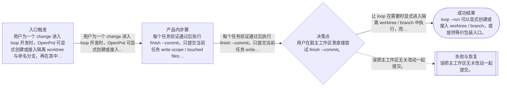

# 流程

## 主流程

- 用户为一个 change 进入 loop 开发时，OpenPrd 可显式创建或接入隔离 worktree 与命名分支，再在其中逐任务运行和提交。
- 每个任务验证通过后执行 finish --commit，只提交当前任务 write-scope / touched files，并把 commit 信息写回状态。
- 评审或回归时，维护者可从状态文件直接定位 worktree、branch、commitSha 和测试报告。

## Mermaid 流程图

## 边界情况

- 用户在脏主工作区里直接尝试 finish --commit。
- 当前任务没有可确定的 write-scope，需要回退到 touched files 或明确失败提示。
- 已有 worktree 存在但 branch 缺失、处于 detached HEAD 或命名不规范。
- 任务验证通过但 commit 写回状态失败，需要保持任务未完全收口并给出修复入口。

## 失败模式

- 误把主工作区无关改动一起提交。
- loop 在 detached HEAD 或错误分支上提交，后续难以审查和回放。
- 状态里只标 done 但缺少 commitSha / worktree 信息，导致无法追溯。
- 隔离 worktree 创建成功，但后续 run / finish 没有使用同一执行环境。
