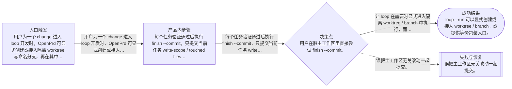
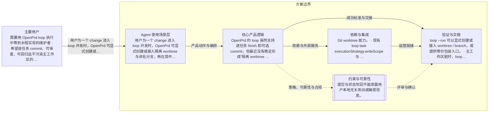

# OpenPrd loop 隔离 worktree 提交闭环
> 语言规则：默认用简体中文生成 PRD、spec、tasks 和用户可见说明；除 PRD、OpenPrd、OpenSpec、API、SDK、CLI、TypeScript、JSON、HTTP、WebSocket、字段 key、命令名、品牌名、产品名和协议名等必要专有名词外，其余内容优先写成简体中文。
- 版本: v0006
- 负责人: Codex
- 产品场景: 以 Agent 为主要使用场景
- 场景模板: 以 Agent 为主要使用场景
- 状态: synthesized
- 生成时间: 2026-06-07 13:07:07
## 元信息

- 标题: OpenPrd loop 隔离 worktree 提交闭环
- 负责人: Codex
- 状态: clarifying
- 版本: v0006
- 产品场景: 以 Agent 为主要使用场景
- 日期: 2026-06-07

## 问题

- 问题陈述: OpenPrd 的 loop 虽然支持逐任务 finish 和可选 commit，但最近没有稳定形成“隔离 worktree + 单任务 commit + 可审查回归”的闭环。当前 loop --run 不会自动切到隔离环境，loop --finish --commit 仍按全仓 git add -A 提交，主工作区一旦有脏改动就容易把无关内容卷进来，导致任务虽然 done 却没有可靠的 commit 留痕。
- 为什么是现在: 最近一个月里 loop 仍有 finish 通过，但没有稳定产出你期望的逐任务 commit 闭环；当前 openprd 仓库也出现了 done 任务没有 commitSha 的情况。要把 L2 和长程实现真正挂到 loop 上，就需要先把隔离执行、提交流程和状态留痕补齐。
- 证据:
  - 最近一个月能查到多次 loop finish 通过，但没有对应的 Commit 记录。
  - 当前 openprd/.openprd/harness/feature-list.json 里 22 个 done 任务的 commitSha 为空。
  - 现有 loop --run 直接在当前 cwd 执行，未自动创建或切换 worktree。
  - 现有 loop --finish --commit 仍按 git add -A 提交，提交范围过宽。
  - 当前隔离副本多为 detached HEAD，缺少稳定的 branch / worktree / commit 绑定。

## 用户与相关方

- 主要用户:
  - 需要用 OpenPrd loop 执行中等到长程实现的维护者
  - 希望逐任务 commit、可审查、可回归且不污染主工作区的 Agent 协作者
- 次要用户:
  - 待补充
- 相关方:
  - OpenPrd 维护者
  - 在脏仓库或长程任务中依赖 loop 的项目协作者

## 目标与成功标准

- 目标:
  - 让 loop 在需要时显式进入隔离 worktree / branch 中执行，而不是默认污染主工作区。
  - 让逐任务 commit 只包含当前任务的改动，便于单独审查和回归。
  - 让 worktree、branch、commitSha 和 session 形成完整可追踪链路。
- 成功指标:
  - loop --run 可以显式创建或接入 worktree / branch，或提供等价包装入口。
  - 主工作区脏时，loop --finish --commit 默认阻断，只有显式豁免才允许继续。
  - 逐任务 commit 不再使用全仓 git add -A，而是基于 write-scope 或本轮 touched files。
  - loop-state.json 与 agent-sessions.jsonl 能记录 worktreePath、branch、commitSha。
- 验收目标:
  - 在隔离 worktree 中连续完成多个 loop 任务时，每个任务都能生成独立 commit，并把 commitSha 写回状态。
  - 在脏主工作区直接尝试 finish --commit 时，会收到明确阻断和豁免提示。
  - 从状态文件和 session 日志可以追溯每个任务对应的 worktree、branch、commit 和测试报告。
  - 新能力不破坏现有 loop 的 plan、next、run、finish、verify 基本路径。

## 范围与非目标

- 范围内:
  - 给 openprd loop --run 增加显式 --worktree / --branch，或提供先创建隔离 worktree 再执行的包装入口。
  - 在 commit 前增加主工作区脏状态门禁和显式 override 机制。
  - 把提交范围从 git add -A 收窄到 task write-scope 或本轮 touched files。
  - 把 worktreePath、branch、commitSha 写入 loop-state.json、agent-sessions.jsonl 以及相关状态输出。
- 范围外:
  - 不在这次能力里自动 push、开 PR 或发布。
  - 不做复杂的交互式冲突解决或自动合并策略。
  - 不强制把每个 task 都拆成独立 worktree；第一版优先支持一个 change / 一段 loop 使用一个隔离 worktree。
  - 不先重做整套 release / publish 工作流。

## 场景与流程

- 主流程:
  - 用户为一个 change 进入 loop 开发时，OpenPrd 可显式创建或接入隔离 worktree 与命名分支，再在其中逐任务运行和提交。
  - 每个任务验证通过后执行 finish --commit，只提交当前任务 write-scope / touched files，并把 commit 信息写回状态。
  - 评审或回归时，维护者可从状态文件直接定位 worktree、branch、commitSha 和测试报告。
- 边界情况:
  - 用户在脏主工作区里直接尝试 finish --commit。
  - 当前任务没有可确定的 write-scope，需要回退到 touched files 或明确失败提示。
  - 已有 worktree 存在但 branch 缺失、处于 detached HEAD 或命名不规范。
  - 任务验证通过但 commit 写回状态失败，需要保持任务未完全收口并给出修复入口。
- 失败模式:
  - 误把主工作区无关改动一起提交。
  - loop 在 detached HEAD 或错误分支上提交，后续难以审查和回放。
  - 状态里只标 done 但缺少 commitSha / worktree 信息，导致无法追溯。
  - 隔离 worktree 创建成功，但后续 run / finish 没有使用同一执行环境。

## 可视化图表

### 产品流程

### 架构

## 需求

- 功能需求:
  - 支持显式 worktree / branch 配置，或提供隔离运行包装命令。
  - 支持检测主工作区脏状态，并在 finish --commit 前阻断高风险路径。
  - 支持基于 write-scope 或 touched files 生成本任务提交集。
  - 支持在 loop 状态、session 日志和测试报告中记录 commit 关联信息。
  - 支持为未满足 commit 前置条件的任务给出清晰诊断与恢复指引。
- 非功能需求:
  - 默认路径必须安全，不能把无关改动静默卷入 commit。
  - 行为必须可追踪，可从状态文件复原任务执行链路。
  - 对现有 loop 用户保持兼容，新增能力应尽量显式开启或有明确默认策略。
  - 失败路径必须可恢复，不能留下半记录状态。
- 业务规则:
  - 逐任务 commit 只在任务验证通过后允许执行。
  - 主工作区脏时默认禁止高风险 commit，除非用户显式豁免。
  - 状态留痕必须与实际 commit 结果一致，不能先写成功后提交失败。

## 业务护栏

- 成本来源:
  - 这次主要要避免无关改动混入 commit、回滚成本升高，以及逐任务审查和回归失去抓手。
- 额度与限制:
  - 默认不允许在脏主工作区直接完成高风险 commit；需要显式进入隔离路径或明确豁免。
- 滥用防护:
  - 不能把未在当前任务范围内的文件静默加入 commit。
  - 不能把 detached HEAD 上的匿名提交伪装成可回归的标准 loop 结果。
- 监控信号:
  - 需要持续看 loop 任务完成后是否稳定写回 commitSha。
  - 需要看 worktreePath、branch、commitSha 是否在状态和 session 日志里一致。
  - 需要看脏主工作区门禁是否挡住了无关改动被带进提交。
- 报警阈值:
  - 只要出现用户要求 commit 但任务完成后没有 commitSha，就算这条闭环没有打通。
  - 只要出现主工作区无关改动被带进 loop commit，就应立即视为高风险回退。
- 止损动作:
  - 无法安全判定提交范围时，停止自动 commit，保留任务验证结果并提示人工处理。
  - worktree / branch 状态异常时，不把任务标记为已完成提交。

## 约束、依赖与风险

- 技术约束:
  - 基于现有 openprd loop / git 流程扩展，不重写整套任务调度。
  - 兼容当前 feature-list、loop-state、agent-sessions 与 test-reports 结构。
  - 需要同时考虑 worktree、命名分支与 detached HEAD 的兼容行为。
- 合规要求:
  - 提交与状态写回不能泄露用户本地无关改动或敏感信息。
- 依赖:
  - Git worktree 能力。
  - 现有 loop task executionStrategy.writeScope 与 finish / verify 流程。
  - OpenPrd 的状态文件、review / change / tasks 主流程。
- 假设:
  - 第一版默认以一个 change / 一段 loop 对应一个隔离 worktree 为优先模型，而不是每个 task 一个 worktree。
  - 已有 task write-scope 在多数实现任务里足够收窄 commit 范围；不足时需要 touched files 补位。
- 风险:
  - 如果 worktree / branch 生命周期设计不清，会显著抬高 loop 使用复杂度。
  - 如果 touched files 收集不稳定，可能出现漏提或误提。
  - 如果状态写回与 git 操作顺序不当，会出现 done / commitSha 不一致。
- 开放问题:
  - 第一版是否明确采用一个 change 一个 worktree、一个 task 一个 commit。
  - worktree / branch 命名规范是否要产品化成 CLI 默认值。
  - override 脏仓库门禁时，CLI 需要多强的显式确认语义。

## 类型专项模块

- 类型: Agent 使用场景专项
- humanAgentContract: 用户决定是否进入 loop、是否要求 commit、是否接受 override；Agent 负责在安全前提下创建隔离执行环境，并维护状态与证据闭环。
- autonomyBoundary: Agent 可以在 loop 运行前准备 worktree、检查脏状态并收集 touched files，但不能在用户未授权 commit 的情况下自动提交，也不能在高风险脏仓库里静默绕过门禁。
- toolBoundary: 优先使用本地 Git 与 OpenPrd loop 状态完成这次能力，不引入新的远端托管或发布前置依赖。
- stateModel: change 进入 loop 后，先绑定隔离执行环境，再逐任务 run / verify / finish / commit，并把 worktree、branch、commit 与测试报告写回同一条状态链。
- evalPlan: 通过 loop 单测、worktree / dirty repo 场景测试、状态持久化测试，以及一次真实隔离 worktree 的串行回归验证这次改动。

## 交接

- 负责人: Codex
- 下一步: 完成 review 确认后生成 change 和 tasks，再实现 loop 的隔离 worktree 提交闭环。
- 目标系统: OpenPrd
